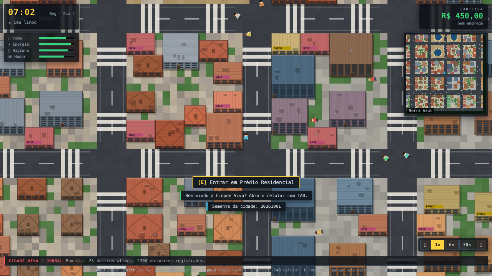
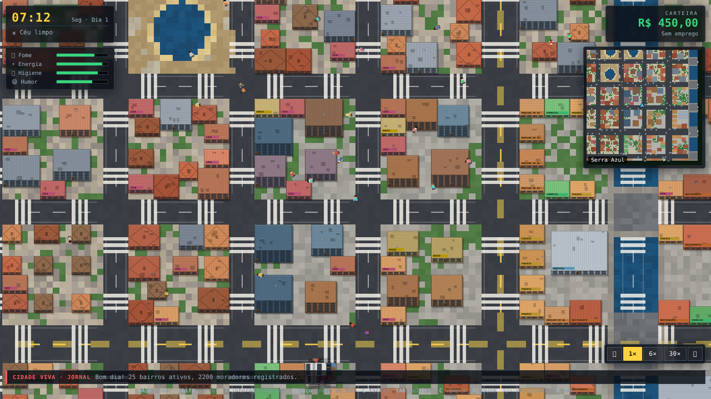
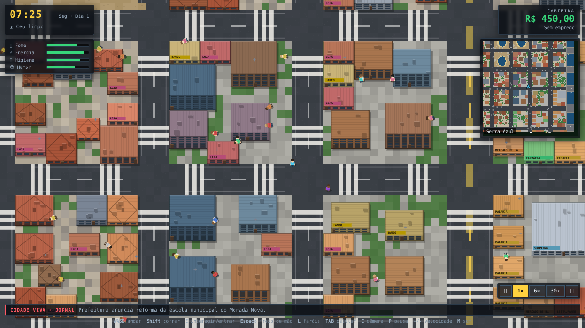
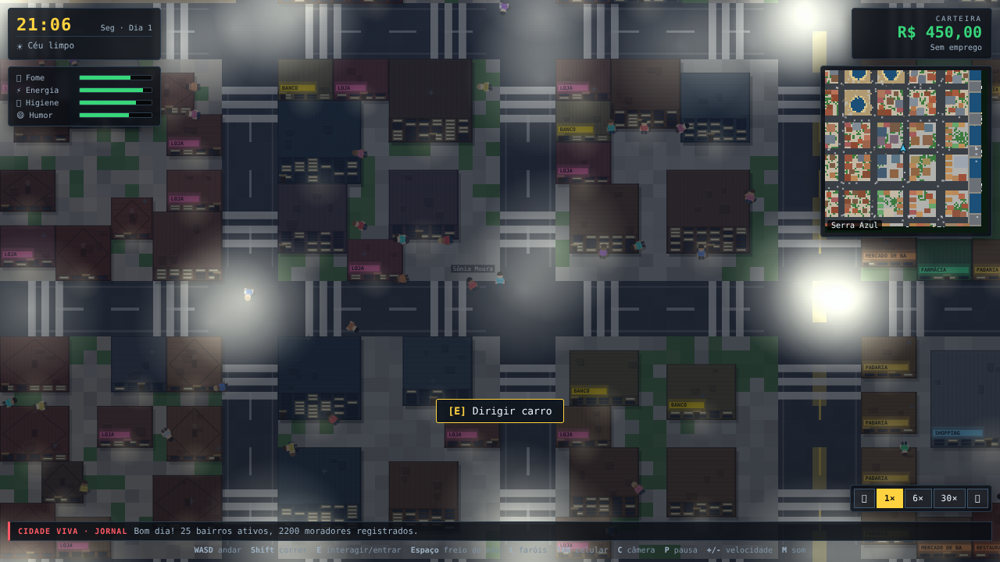

# Comparação: imagem de referência × jogo

Análise **pelo fato** — o que está igual, o que está parecido e o que ainda está diferente
entre a imagem de referência em pixel-art (visão de cima) e a cidade gerada pelo jogo.

> Capturas feitas rodando o **próprio arquivo publicado** (`LIFE-CIDADE-VIVA.html`),
> aberto direto do disco, sem servidor — é exatamente o que você vê ao dar dois cliques.

| # | Captura | O que mostra |
|---|---|---|
| 1 |  | Rua de bairro: calçadas, faixas de pedestre, lojas, casas, postes |
| 2 |  | Visão ampla (a que mais se compara com a imagem de referência) |
| 3 |  | Avenida com faixa central amarela, estacionamentos e prédios variados |
| 4 |  | Ciclo de 24 h: janelas acesas, letreiros luminosos e postes |

---

## Elemento por elemento

| Elemento da referência | No jogo | Situação |
|---|---|---|
| Malha de ruas em quadras | Ruas em quadras com avenidas mais largas e travessas | **Igual** (a referência tem uma via diagonal, o jogo é em grade) |
| Faixas de pedestre nas esquinas | Faixas em "escada" nas quatro esquinas, igual à referência | **Igual** |
| Faixa central das avenidas | Linha amarela dupla nas avenidas e branca nas ruas | **Igual** |
| Calçadas com postes, lixeiras, bancos, hidrantes, semáforos | Todos presentes e distribuídos pelas calçadas | **Igual** |
| Parque com lago | Lago com margem de areia, pier e parque ao redor | **Parecido** (o desenho do lago é mais geométrico) |
| Canal / rio com pontes | Canal da cidade com pontes de asfalto e pier | **Parecido** (a referência tem rio mais largo e sinuoso) |
| Casas com telhado inclinado | Casas com telhado, caixa d'água, antena e quintal | **Igual** |
| Lojas e comércio de rua com fachada | Fachada com janelas, porta iluminada e letreiro por tipo (padaria, banco, loja…) | **Igual** |
| Prédios altos variados no centro | Torres, escritórios e apartamentos com paleta variada | **Igual** |
| Carros circulando | Trânsito com faixas, semáforos, faróis e buzina | **Igual** |
| Carros estacionados em vagas | 17 estacionamentos com 76 carros parados e linhas de vaga | **Igual** |
| Pedestres andando e atravessando | 2.200 moradores, ~190 ativos perto da câmera, atravessam na faixa | **Igual** |
| Vegetação: árvores, arbustos, canteiros | Árvores de calçada, pátios internos e canteiros nos quarteirões | **Igual** |
| Quarteirões densos (sem vazios) | Preenchimento em duas passadas + quintais de terra ao redor dos imóveis | **Parecido** (ainda há áreas de pátio mais abertas) |
| Estética pixel-art chapada | Traço chapado com sombra projetada, sem gradientes | **Igual** |
| Visão de cima | Câmera de cima com zoom 0,62×–2,6× (`C` alterna) | **Igual** |
| Escala do mapa | 294×294 tiles (~4,7 mil × 4,7 mil pixels de cidade), 25 bairros | **Igual** / maior |
| — | Ciclo de 24 h, clima, interiores exploráveis, empregos e economia | **A mais** no jogo (a imagem é estática) |

## O que ainda está diferente (honestamente)

1. **Via diagonal**: a referência tem uma avenida diagonal cortando a malha; o jogo é em grade ortogonal.
2. **Rio/canal**: no jogo o canal é mais estreito e reto; na referência ele é largo e sinuoso.
3. **Densidade**: a referência é preenchida até a borda; no jogo alguns pátios internos ainda ficam mais vazios que o ideal.
4. **Contagem de detalhes finos**: a referência tem variações de telhado e mobiliário urbano por quarteirão que o jogo resolve de forma procedural (às vezes repete padrão).

## Números medidos (no arquivo publicado, 0 erros de console)

| Métrica | Valor |
|---|---|
| Imóveis | 1.040 |
| Estacionamentos / carros parados | 17 / 76 |
| Props (postes, árvores, bancos…) | 4.386 |
| Moradores (simulação) | 2.200 |
| Negócios com interior | 359 |
| Bairros | 25 |
| Missão de entrega | concluída ✅ |
| Corrida de táxi | concluída ✅ |
| Entrar em mercado e comprar | ✅ (7 itens na prateleira) |
| Dirigir | 113 km/h ✅ |
| Mundo a 30× sem o jogador | relógio 07:05 → 07:34, trânsito e moradores seguem ✅ |
| Erros de console | **0** |
