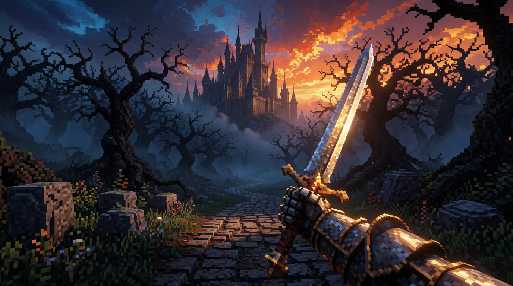

## Jogo — The Ashen Way

🎮 **[Jogar agora no navegador](https://cdn.jsdelivr.net/gh/GUILHERMEFMAGA/GUILHERMEFMAGA-SITE@8c9d2de/game/index.html)**

Protótipo jogável de fantasia sombria em primeira pessoa, usando a arte escolhida como cena inicial e aproximando a câmera da fortaleza conforme você avança.

```bash
python3 -m http.server 8080 --bind 0.0.0.0
```

Abra <http://localhost:8080/game/>. **WASD** move, **Shift** corre, o mouse olha, **Espaço** golpeia, **R** reinicia e **Esc** pausa. A implementação e seus limites estão em [game/README.md](game/README.md).

---

# Meu agente de IA local 🤖

Este repositório contém o **NÚCLEO**: um agente de IA que roda no meu computador,
escrito em **Python puro**, **sem API paga**, **sem Ollama** e **sem instalar nenhum pacote**.

Ele tem rede neural (feita do zero), memória, ferramentas e automações no estilo n8n.

👉 Comece por aqui: **[agente-ia/GUIA-DO-INICIADOR.md](agente-ia/GUIA-DO-INICIADOR.md)**
(passo a passo do zero, em português, feito para quem está começando)

📘 Documentação técnica: **[agente-ia/LEIA-ME.md](agente-ia/LEIA-ME.md)**

## Rodar em 10 segundos

```bash
cd agente-ia
python main.py        # conversa no terminal
python main.py web    # painel no navegador (http://localhost:8000)
```

## O que ele faz

| Recurso | Estado |
|---|---|
| Rede neural MLP treinada com backpropagation (só biblioteca padrão) | ✅ |
| Memória curta + memória longa em SQLite (`meu nome é ...`) | ✅ |
| 11 ferramentas: cálculo seguro, arquivos, resumo, análise de texto, sistema | ✅ |
| Automações estilo n8n: gatilho por horário/intervalo e passos com `{{variaveis}}` | ✅ |
| Painel web sem Flask (servidor HTTP da biblioteca padrão) | ✅ |
| "Não sei" honesto quando a confiança é baixa (anti-alucinação) | ✅ |

## Referência visual do jogo


