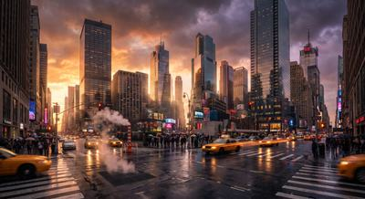

# 🌇 CIDADE DOURADA — jogo 3D

Um jogo de **mundo aberto 3D** que roda inteiro no navegador: você dirige um **táxi**
por uma metrópole fotorrealista que começa na **hora dourada** (igual à imagem de
referência que gerou o projeto), vira **pôr do sol** e termina na **noite neon**, com
asfalto molhado, chuva, trânsito e pedestres.

> Conceito visual baseado em `jogo/assets/capa.jpg` (cidade realista gerada por IA).



---

## ▶ Como jogar

**Opção 1 — só abrir o arquivo**
Dê dois cliques em `index.html`? Não: o jogo usa *ES modules*, então precisa de um
servidor HTTP (o navegador bloqueia módulos em `file://`).

**Opção 2 — servidor local (recomendado)**
```bash
cd jogo
python3 -m http.server 8000
# abra http://localhost:8000
```
ou, se tiver Node:
```bash
npx serve .      # ou: npx http-server -p 8000
```

**Nada para instalar:** o Three.js r160 está *vendored* em `vendor/three/`
(sem CDN, funciona offline).

### Controles

| Tecla | Ação |
|---|---|
| `W` / `↑` | acelerar |
| `S` / `↓` | frear / ré |
| `A` `D` / `←` `→` | volante |
| `Espaço` | freio de mão (drift) |
| `C` | alterna câmera (perseguição · capô · alta) |
| `H` | buzina |
| `R` | liga/desliga a rádio synthwave |
| `M` | liga/desliga o som |
| `P` / `Esc` | pausa |
| mouse (arrastar) | olhar em volta |
| toque | botões na tela (celular/tablet) |

### Objetivo

1. Vá até o **feixe ciano** e **pare** ao lado dele para embarcar o passageiro.
2. Leve-o até o **feixe laranja** e pare de novo.
3. Cada corrida dá pontos (distância × **combo**) e **+14 s** no relógio.
4. Bater **zera o combo**. Fichas douradas dão **+25 × combo** e +1,2 s.
5. Tem também o **Modo Livre**: sem cronômetro, só dirigir pela cidade.

---

## 🛠 O que tem por baixo do capô

| Sistema | Como foi feito |
|---|---|
| **Cidade** | 100% procedural (semente fixa): 6×6 quarteirões, ~150 prédios com subdivisão de lote, torres escalonadas, pódios, parques e praças |
| **Fachadas** | shader customizado **triplanar** em `InstancedMesh` (1 draw call p/ todos os prédios) com 4 máscaras de janela geradas em canvas; janelas **acendem sozinhas** quando anoitece |
| **Céu** | shader de gradiente + disco solar + nuvens em faixas + estrelas; o mesmo céu gera o **environment map (PMREM)** que dá reflexo PBR em vidro, carro e asfalto molhado |
| **Ciclo de luz** | hora dourada → pôr do sol → crepúsculo → noite (interpolado por keyframes, mexe em sol, névoa, exposição e luzes) |
| **Chuva** | riscas 3D que seguem a câmera, respingos no chão e **gotas na lente** |
| **Trânsito** | IA por faixas: freia atrás de carros, para no **vermelho** do semáforo e desvia de você |
| **Física do carro** | arcade com drift, marcas de pneu, spray d'água, colisão AABB contra prédios e círculo contra carros |
| **Pós-processamento** | `UnrealBloomPass` + passe próprio de **gradação** (aberração cromática, vinheta, granulação, pulso vermelho de dano) + `OutputPass` (ACES) |
| **Áudio** | 100% sintetizado em WebAudio: motor (2 osciladores + ruído), chuva, derrapagem, buzina, impactos e uma **rádio synthwave gerativa** |
| **Interface** | HUD em DOM, **minimap** em canvas 2D com rotação, seta de borda apontando o objetivo, 3 presets de qualidade |

Nenhuma textura, modelo 3D ou som foi baixado — tudo é gerado por código.

## 📁 Estrutura

```
jogo/
├─ index.html          telas (menu, pausa, fim) + HUD + import map
├─ style.css           interface
├─ assets/capa.jpg     imagem de referência (cidade realista)
├─ vendor/three/       Three.js r160 + addons de pós-processamento (offline)
└─ src/
   ├─ main.js          game loop, câmera, HUD, missões, pontuação
   ├─ config.js        medidas da cidade, física, presets de qualidade
   ├─ env.js           céu, sol, névoa e ciclo dia/noite
   ├─ city.js          geração da cidade (prédios, ruas, postes, neons, pedestres)
   ├─ cars.js          carro do jogador + trânsito + marcas de pneu
   ├─ rain.js          chuva, respingos e gotas na lente
   ├─ textures.js      texturas procedurais (fachadas, asfalto, placas de neon)
   ├─ audio.js         motor, efeitos e rádio (WebAudio)
   ├─ input.js         teclado, mouse e toque
   └─ util.js          brilhos baratos (nuvem de pontos aditiva)
```

## ⚙️ Desempenho

Use o seletor **Qualidade** no menu (fica salvo no navegador):

- **Alta** — sombras 2048, bloom, 74 carros, chuva densa, 90 pedestres
- **Média** — sombras 1024, bloom mais suave, 46 carros
- **Baixa** — sem sombras/bloom, 24 carros, chuva leve (para PC integrado ou celular)

---

Feito para o repositório **GUILHERMEFMAGA-SITE** 🚕
